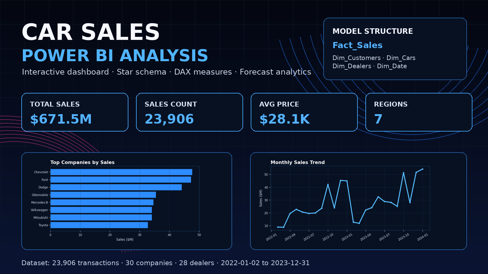

# Car Sales Power BI Analysis

Power BI data analysis project focused on car sales performance, customer profile, dealer performance, product characteristics, and sales trends.

The project uses a full car sales transaction dataset and turns it into an interactive Power BI report with cleaned data, a star schema data model, DAX measures, report pages, slicers, hierarchies, and forecast analysis.



## Project Overview

The goal of this project was to analyze car sales performance from several business perspectives:

- overall sales performance
- sales trends over time
- company and model performance
- car characteristics
- customer groups
- dealer and region performance
- possible future sales direction using forecast analytics

The project was originally completed as a course-based Power BI assignment and was later cleaned and structured for public portfolio use.

## Dataset

The dataset contains individual car sale transactions. Each row represents one completed vehicle sale and includes customer information, car specifications, dealer details, and transaction data.

Dataset size:

- 23,906 rows
- 16 columns
- period: 2022-01-02 to 2023-12-31

Main columns:

- `Car_id`
- `Date`
- `Customer Name`
- `Gender`
- `Annual Income`
- `Dealer_Name`
- `Dealer_No`
- `Dealer_Region`
- `Company`
- `Model`
- `Body Style`
- `Engine`
- `Transmission`
- `Color`
- `Price ($)`
- `Phone`

## Data Model

The original dataset was transformed from a flat table into a star schema model.

Main fact table:

- `Fact_Sales`

Dimension tables:

- `Dim_Customers`
- `Dim_Cars`
- `Dim_Dealers`
- `Dim_Date`

Relationships:

- `Fact_Sales[CustomerID]` → `Dim_Customers[CustomerID]`
- `Fact_Sales[CarID]` → `Dim_Cars[CarID]`
- `Fact_Sales[DealerID]` → `Dim_Dealers[DealerID]`
- `Fact_Sales[SaleDate]` → `Dim_Date[SaleDate]`

The model uses many-to-one relationships and single-direction filtering from dimension tables to the sales fact table.

## DAX Measures

Main DAX measures used in the report:

```DAX
Total Sales = SUM(Fact_Sales[Price ($)])

Sales Count = COUNT(Fact_Sales[SaleID])

Average Price = AVERAGE(Fact_Sales[Price ($)])

Max Price = MAX(Fact_Sales[Price ($)])

Min Price = MIN(Fact_Sales[Price ($)])

Average Annual Income = AVERAGE(Dim_Customers[Annual Income])
```

A percentage-of-total measure was also used to understand category contribution to total sales.

## Report Pages

The Power BI report includes five main analysis pages:

### 1. Sales Overview

A high-level summary of sales performance using KPI cards, sales trends, monthly sales count, total sales, slicers, and forecast analysis.

### 2. Company Analysis

Analysis of car company performance by total sales, sales count, average price, and sales share.

### 3. Car Characteristics Analysis

Analysis of car models, body styles, engine types, transmission types, and colors.

### 4. Customer Analysis

Analysis of customer gender, income groups, average annual income, sales count, and average price.

### 5. Dealer & Region Analysis

Analysis of dealer regions and individual dealers by total sales, sales count, and average price.

## Forecast Analysis

The report includes a forecast visual on the Sales Overview page.

Forecast setup:

- value: `Total Sales`
- date field: `Month Start`
- forecast length: 3 months
- seasonality: Auto
- confidence interval: 95%

The forecast is used to estimate a possible future direction of sales based on historical performance.

## Tools & Technologies

- Power BI Desktop
- Power Query
- DAX
- Data modeling
- Star schema
- Forecast analytics
- CSV dataset

## Repository Structure

```text
Car-Sales-Power-BI-Analysis/
├── README.md
├── data/
│   └── car_sales.csv
├── docs/
│   ├── data_model.md
│   ├── dax_measures.md
│   ├── project_summary.md
│   └── report_pages.md
├── images/
│   └── car-sales-power-bi-analysis-cover.png
└── powerbi/
    └── car_sales_power_bi_report.pbix
```

## Files

- `powerbi/car_sales_power_bi_report.pbix` — Power BI report file
- `data/car_sales.csv` — source dataset used in the report
- `docs/project_summary.md` — cleaned project summary
- `docs/data_model.md` — data model explanation
- `docs/dax_measures.md` — main DAX measures
- `docs/report_pages.md` — report page breakdown
- `images/car-sales-power-bi-analysis-cover.png` — project cover image

## Key Findings

- Car sales performance should be evaluated using multiple metrics, not only total revenue.
- Sales trends change over time and should be analyzed by year, quarter, and month.
- Company and model analysis helps identify stronger product segments.
- Customer profile analysis helps compare sales behavior by gender and income group.
- Dealer and region analysis helps identify stronger and weaker sales areas.
- Forecast analytics can support directional planning, although it should not be treated as an exact prediction.

## What I Learned

Through this project, I practiced:

- importing and cleaning data in Power BI
- transforming a flat dataset into a structured data model
- building relationships between fact and dimension tables
- creating DAX measures
- designing interactive report pages
- adding slicers and hierarchies
- using forecast analytics
- turning business questions into a dashboard structure

## Project Status

Completed and cleaned for public portfolio use.
